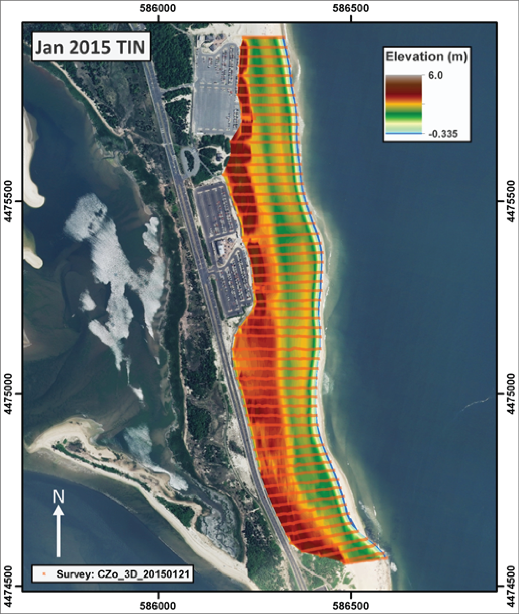
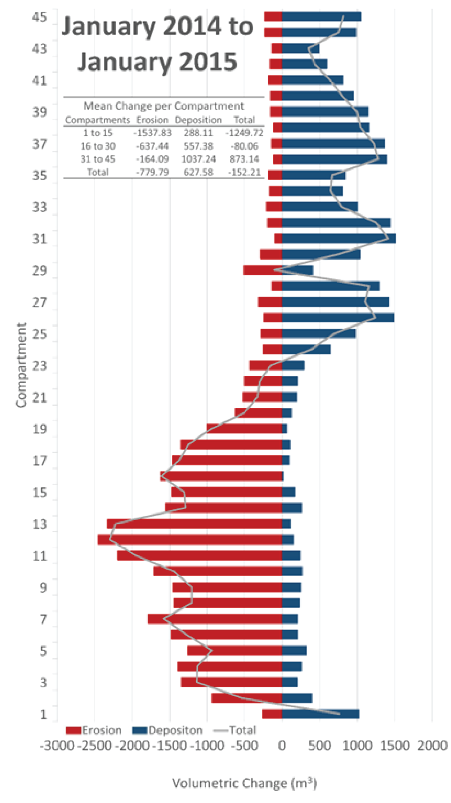

## Summary
Topographical change within the coastal landscape reflects the variable environmental conditions that control sediment transport along and across the shore [@DavidsonArnott:2019]. Wave conditions, water level, and currents are the primary physical process drivers of topographical change to the beach [@Masselink:2014], which is also subaerially influenced by aeolian transport [@Bauer:2009]. Anthropogenic structures/interventions also affect the influence of physical processes on sediment transport and coastal geomorphological change [@Miselis:2017]. Generally, storm-driven waves and elevated water levels create coastal set-up and wave runup conditions that erode the beach [@Sallenger:2000] and an offshore vector of nearshore sediment transport [@Goff:2015;@Glenn:2008]. Moreover, clusters of storm events can exacerbate the erosion of beaches and dunes [@Splinter:2014]. During more quiescent periods of time, fair weather waves can move sand shoreward through the nearshore [@Styles:2005] and deposit sand in the foreshore, facilitating growth of the beach [@Thom:1991]. The dependency of coastal geomorphology on the temporally variable processes acting on a given stretch of shoreline underscores the need to systematically and accurately measure coastal topographical change. These datasets that record coastal topographical change capture the cumulative response of the coast to forcing [@Miller:2004] and offer a basis to understand the relationships between physical processes, human influence, geomorphological response, and outcomes relevant to coastal stakeholders [@Allen:2000]. As a result, these data inherently facilitate scientifically informed management of coastal resources. Specifically, an accurate quantification of coastal geomorphological change fosters a better understanding of the processes that cause it, and provides administrators with information like sediment budgets and shoreline change metrics relevant to common coastal resource management concerns like erosion, infrastructure planning, and preservation of natural habitat [@Carapuco:2016].
To this end, @Psuty:2018a have, through the Northeast Coastal and Barrier Network of the National Park Service, developed and implemented a protocol, “Coastal Landform Elevation Models”, for the collection of high accuracy topographical data to volumetrically measure coastal geomorphological change. This protocol is a component of a regionally applied program to monitor coastal geomorphological change [@Psuty:2018b] that leverages specific geoindicators to concisely convey information regarding the state of beaches for coastal administrators [@Carapuco:2016]. Dozens of technical reports have been generated to date using these protocols and the methods described have been used and/or adapted for coastal geomorphological research [@Silviera:2009;@Psuty:2011;@Psuty:2014;@Psuty:2016;@Psuty:2019;@Psuty:2020;@Schmelz:2024]. 
Here we present a Python based analytical tool that implements the data analysis tasks described in SOP7 (Standard Operating Procedures section #7) of the “Coastal Landform Elevation Models” protocol described above [@Psuty:2018a].  As input, the script receives data collected during coastal topographical surveys at a given site and calculates volumetric changes that occurred between surveys and across the study duration. The tool is implemented using ESRI ArcGIS software and written using ArcPy to take advantage of the visualization and data management capabilities of the software. The tool streamlines the: 1) processing of a collection of point-cloud topographical datasets collected during topographical surveys into digital elevation models (DEMs) through Delaunay triangulation (\autoref{fig:Figure1}); 2) normalization of the spatial and vertical domain for each of the generated DEMs facilitating calculation of volumetric change above a given vertical datum within a defined study area (\autoref{fig:Figure2}); and 3) the computation of volumetric change for predefined compartments within the study area (\autoref{fig:Figure3}). These methods have been applied to both 3D RTK-GNSS [@Psuty:2014;@Psuty:2016;@Psuty:2019;@Psuty:2020] and UAS (unmanned aircraft systems) generated [@Schmelz:2024] topographical data.

{ width=95% }

{ width=95% }

{ width=75% }

## Statement of need
Coastal landscapes, including beaches and dunes, represent invaluable natural resources that offer immense environmental, economic, recreational, and cultural benefits to the 600 million people who reside in coastal communities globally [@Mcgranahan:2007;@Fitzgerald:2008]. However, as beaches and dunes are eroded, the benefits they provide are invariably lost, which underscores the importance of understanding how coastal landscapes change in response to physical the processes acting on them [@Carapuco:2016]. Spatiotemporal trends in volumetric change can help evaluate and constrain critical zones of shoreline experiencing erosion [@Psuty:2014;@Psuty:2016], and relationships between coastal topographical change and physical process can be established when high-resolution topographical data is coupled with data records that capture hydrodynamic forcing [@Allen:2000;@Schmelz:2024]. However, these analyses hinge on an ability to process and analyze a large volume of topographical survey data. The application of SOP7 within the “Coastal Landform Elevation Models” protocol [@Psuty:2018a] would be prohibitively time consuming if applied without automation for potentially hundreds of intrasite compartments, as needed to evaluate spatiotemporal trends with 10-20 meter alongshore spatial resolution for kilometer-scale study sites. The Python script we document here facilitates the processing tasks that enable further analyses of the data. Critically, as described in detail in the protocol text, the processes in the software provided: 1) offer an efficient method for the generation of comparable DEMs within a defined planimetric and vertical spatial domain from point data collected during multiple topographical surveys; 2) represent a standardized methodology to calculate volumetric change across the entire spatial domain through the entirety of the study period, as well as the calculation of spatial variability in volumetric change within the site and between individual surveys; and 3) provides a tool to quickly produce professional quality images that represent the volumetric changes captured by the survey data. 

## Methods
The Python based analytical tool we provide performs the data analysis tasks defined by the “Coastal Landform Elevation Models” protocol [@Psuty:2018a] of the Northeast Coastal and Barrier Network of the National Park Service. We refer the reader to the Standard Operating Procedures defined in @Psuty:2018a (https://irma.nps.gov/DataStore/Reference/Profile/2253970) for a comprehensive presentation of the methods that are implemented through the software we provide and document here. Please cite this protocol in the documentation of any application of this software.

## Acknowledgements
We acknowledge the contributions of the members of the Rutgers team that have helped collect data that contributed to the development of this code, including: Tanya Silveira, Monica Patel, Joelle Freeman, Michael Towle, Sean McLaughlin, Ally Huggins, Carlos Carvajal, Tucker Fullmer, Brian Kempf, Kyle Nicholas, Irina Beal, Joshua Greenberg, Elizabeth Haussner, Michael Endicott, Dan Soda, Paul Zarella, Peter Dennehy, Peter Shipton, Barry Shafer, Mario Resina, Aaron Love, William Hudacek, Jake McDermott, and John Gagnon.

## References
